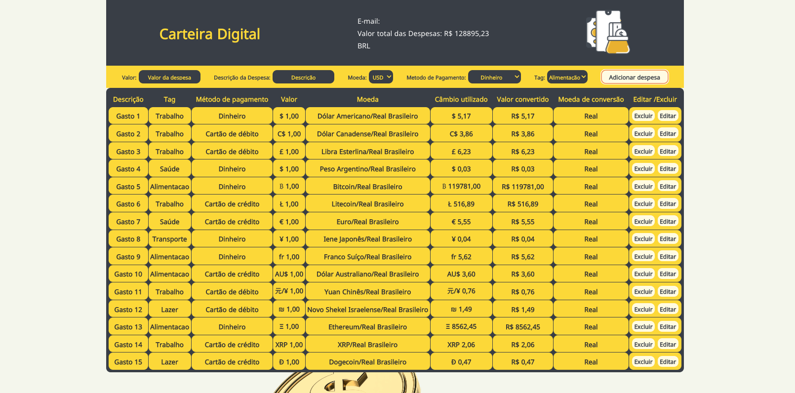

# Carteira-Digital

Mais um desafio construir essa aplicação, usando React e Redux, a aplicação trata-se de uma carteira digital.
Você consegue adicionar despesas e converter o valor para outra moeda, sendo possível editar essa despesa e também excluir.

Clique no link abaixo para acessar a aplicação.

[Deploy Carteira Digital](https://carteira-digital-filipebueno85.vercel.app/carteira)

